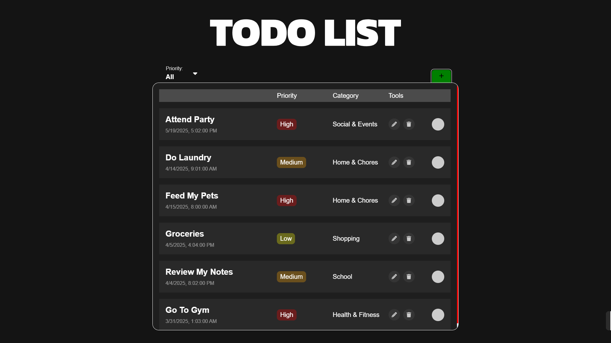

# Todo List App

## Created by Falcasantos and Villares

Stay organized and boost productivity with our smart to-do list! Easily categorize tasks, set priorities, and track progress for work, personal goals, and daily routines—all in one place.

🔗 **Live Demo:** [Todo List App](https://todolistapp-falcasantos-villarez.netlify.app/)

---

## Features

✅ Add, edit, and delete tasks  
✅ Organize tasks into categories  
✅ Set priorities (high, medium, low)  
✅ Track progress with status updates  
✅ User-friendly and responsive UI

---

## 📷 Screenshots



---

## Technologies Used

- HTML, CSS, JavaScript
- React
- LocalStorage

---

## Getting Started

### 1️⃣ Clone the Repository

```bash
git clone https://github.com/milbertF/project-todolist.git
cd todo-list-app
```

### 2️⃣ Install Dependencies

```bash
npm install
```

### 3️⃣ Run the App

```bash
npm run dev
```

## Contributing

Contributions are welcome! Feel free to submit issues or pull requests.

## License

This project is licensed under the MIT License.

## Contact:

If you have any questions, feel free to reach out! [mfalcasantos23@gmail.com](https://mail.google.com/mail/?view=cm&fs=1&to=mfalcasantos23@gmail.com) send your thoughts and suggestions here.
